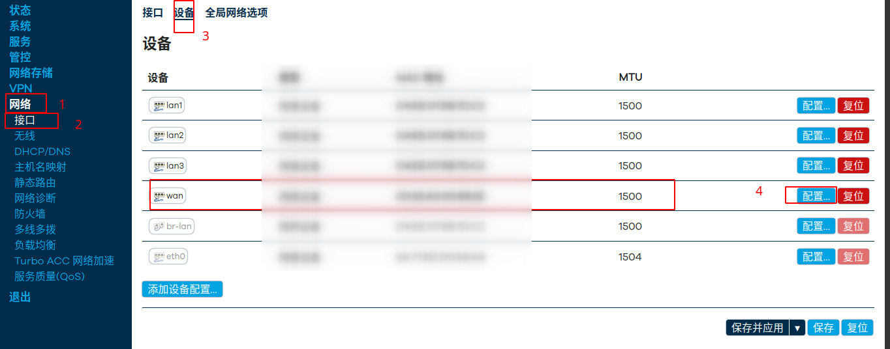
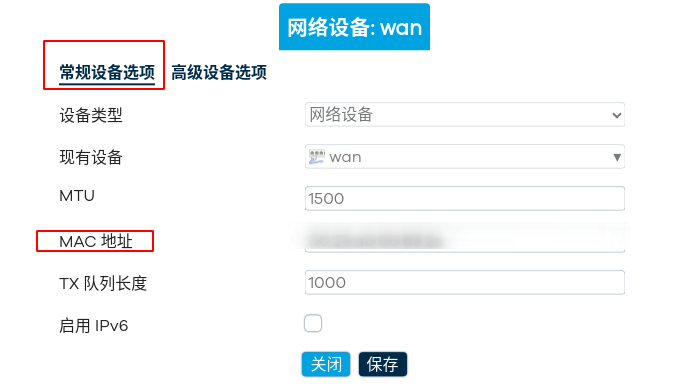
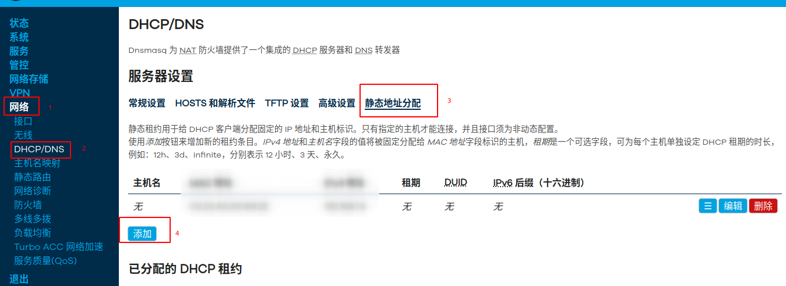
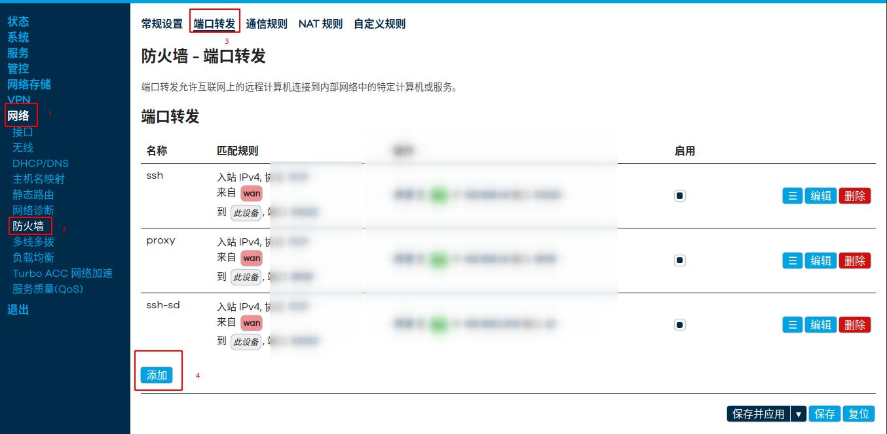

## default密码：

```
password
```

## lan口推送DNS服务

用 LuCI 界面,进入 网络 --> 接口 --> LAN --> DHCP 服务器 --> 高级设置
在 DHCP 选项 里加上：
```
6,172.17.103.5,172.17.103.2,172.17.103.1
15,loongson.cn
```
如下图所示


解释：
6 --> DNS 服务器
15 --> Domain Name（会改 domain lan → domain loongson.cn）

## 配置wan口mac

用 LuCI 界面,进入 网络 --> 接口 --> 设备 -->配置 --> 常规设备选项 --> MAC地址




## 配置静态IP



## 配置端口转发



