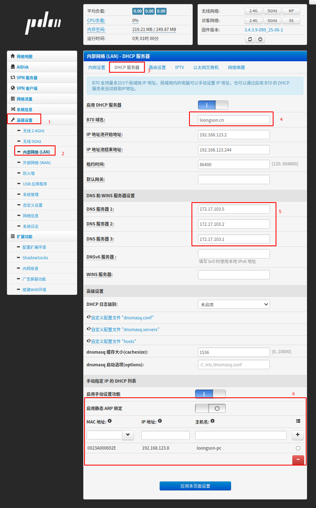
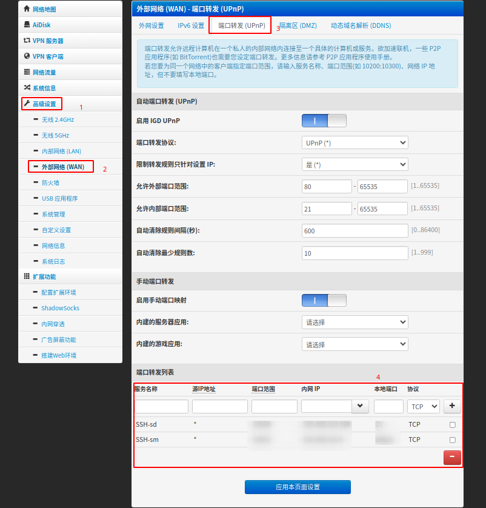

# B70 路由器 Padavan 固件说明

## 1. H 大的 Padavan 固件

### 1.1 固件主页

```
https://opt.cn2qq.com/
```

> 提示：  
> 请在 **padavan** 目录中搜索以 **B70** 开头的固件进行下载。

### 1.2 默认配置（通常情况）

| 项目 | 默认值 |
|---|---|
| 网关地址 | `192.168.123.1` |
| 管理页面 | http://my.router/ 或 http://192.168.123.1/ |
| 管理账号 | `admin` |
| 管理密码 | `admin` |
| Wi-Fi 默认密码 | `1234567890` |

> **注意：刷入固件后不会自动恢复出厂设置**  
> 若路由器之前使用刷过Pandavan固件, 并修改管理员账号/密码，则再刷入Padavan固件后管理账号/密码可能与默认值不一致。

---

## 2. 当前 B70 固件登录信息说明

重新刷写该固件后，管理账号密码与默认信息不同：

| 管理账号 | 管理密码 |
|---|---|
| `root` | `Sm123!@` |

请使用以上账号密码登录管理界面。

---

## 3. 老毛子 Padavan 固件资源

### 3.1 固件发布频道
```
https://t.me/s/pdcn1
```

### 3.2 固件交流讨论群
```
https://t.me/pdcn2
```

### 3.3 iOS 交流群
```
https://t.me/pdcn3
```

---

## 4. 一键自动更新固件脚本

在路由器 SSH/Telnet 中执行：

```
wget --no-check-certificate -O- https://opt.cn2qq.com/opt-script/up.sh > /tmp/up.sh && bash < /tmp/up.sh &
```

---

## 5. 常见配置

### 5.1 修改wan口mac


### 5.2 配置DHCP和静态IP




### 5.3 配置端口转发




---

## 6. 常见故障排除

**症状：**  
刷入 Pandora/Padavan 固件后，管理界面操作卡顿、Ping 网关丢包。

**原因：**  
路由器 **MAC 地址未设置或丢失**。

**解决方法：**  
进入 **Breed** 恢复控制台，重新设置 MAC 地址：

- 将 **LAN 口 MAC** 设置为路由器背面机身标贴上的地址。
- 将 **WAN 口 MAC** 设置为 **LAN 口 MAC + 1（最后一位加 1）**。

示例：

```
LAN 口: D4EE075B7DC2
WAN 口: D4EE075B7DC3
```

设置完成后保存重启，网络恢复正常。

