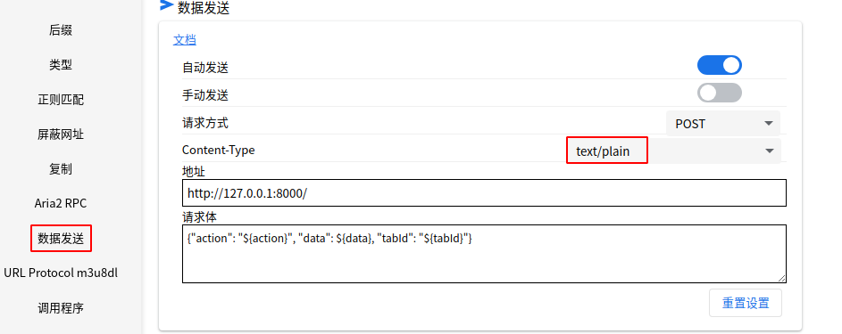

## Chrome Web Store install cat-cach

 [猫抓插件](https://chromewebstore.google.com/detail/%E7%8C%AB%E6%8A%93/jfedfbgedapdagkghmgibemcoggfppbb)

[猫爪github地址](https://github.com/xifangczy/cat-catch)

### config cat-cach

1、安装完插件后点击插件猫图标

2、点击`设置`

3、找到`数据发送`

4、将`Content-Type`更改为`text/plain`



## run listen_music.sh

1、install jq
```
sudo apt install jq
```
2、 bash ./listen_music.sh

ss -lnt 可以看到8000端口已经被监听

```
✗ ss -lnt |grep 8000       
LISTEN    0         10                 0.0.0.0:8000             0.0.0.0:*       
LISTEN    0         10                    [::]:8000                [::]:*   
```

## send data to 8000

1、打开[无忧音乐网](https://www.qeecc.com/)

2、点开一首歌曲

3、点击猫抓插件按钮

4、正确情况下可以嗅探到音乐数据，点击音乐数据后的 

5、在运行listen_music.sh脚本的路径下，会生成playlist.m3u

## vlc 

1、打开vlc

2、媒体-->打开文件-->playlist.m3u

3、enjoy music
